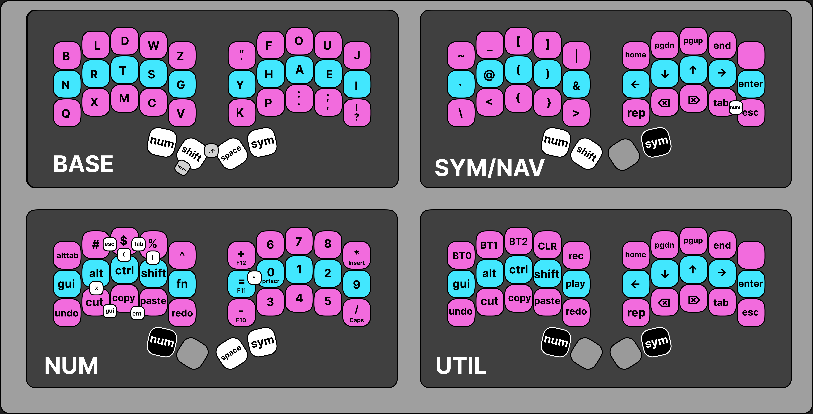

# Anachron ZMK Keyboard Layout ⌛⌨️

 _Designed by @mkkaufmann and @theol0403.
Inspired by urob, callum, seniply, t-34, phnoty, keymapdb_. Alpha layout
pictured is [graphite](https://github.com/rdavison/graphite-layout).

## Introduction

> **anachronism (noun.)** /əˈnæk·rəˌnɪz·əm/ : a person or a thing that is
> chronologically out of place; a chronological inconsistency.

Anachron is a keyboard layout designed for 34-key keyboards, implemented with
ZMK. It aims to provide a fast, intuitive, and cohesive typing experience. It is
similar to trilayer-based layouts such as
[callum](https://github.com/qmk/qmk_firmware/blob/master/users/callum/readme.md)
or [seniply](https://stevep99.github.io/seniply/), but provides a unique layer
design and additional features taking advantage of ZMK. The implementation has
been heavily inspired by the work of [urob](https://github.com/urob/zmk-config).

## Highlights

- timer-free layers, accelerated by **anachron combos**
- intuitive and logical **consistency of the trilayer**
- **one-handed mods**, shortcuts, and navigation, designed for mouse usage
- fully-featured number pad with **easy math symbols**
- sticky **shift on thumb**, capsword, and numword

## Overview

### Layer Design

Left thumb + left hand will always produce modifiers and right thumb + right
hand will always produce navigation. Layers are sticky by default, and are
deactivated after a timeout.

Double-tapping num will enable
[numword](https://github.com/urob/zmk-config#numword). Tripple-tapping num will
toggle the num layer.

Shift is sticky on the left thumb, and
[capsword](https://github.com/urob/zmk-config#capsword) is enabled by
double-tapping.

Mods on the left hand are sticky, but are
[lazy](https://github.com/zmkfirmware/zmk/pull/1812), have a relatively fast
timeout, are held while the key is being pressed
([PR](https://github.com/zmkfirmware/zmk/pull/1811)), and are not sticky after
being held (using a clever combination of hold-taps and additional PRs).

### Anachron Combos

- callum style layers, but with combos to speed them up
- mash them together, release with intuitive behavior

### Extra Features

Many of the features documented in urob's layout have been borrowed, including
optional timeless homerow mods (not enabled by default), intuitive mod-morphs,
swapper, repeat, space+shift, etc.

Additionally, vertical combos are used to allow you to mash SFBs together with
one finger and have it resolve to the more common one.

## Design Principles

In general, anachron is designed with the following principles in mind. These
are defined from anecdotal experience and aim to ease frustrations with hold-tap
based layouts.

### Timers cause uncertainty, hesitation, and friction

There are many layouts, the most popular being
[miryoku](https://github.com/manna-harbour/miryoku), that use hold-taps to
access layers and home-row mods. However, after a year of typing on such
layouts, I have found that the timers impeded my ability to feel confident in my
typing, and introduced many minor usability issues. For example, you have to
make each keypress be distinct to avoid triggering a home-row hold, keypresses
are delayed while typing, key-repeat for home-row keys is impossible, shifting
entire words is awkward without caps-word, and you always need both hands on the
board at all times.

Instead, anachron must feel like a regular keyboard when typing alphas, where
keys mashed together with the slightest delay between them should be handled
without interference regardless of release order. Also, there should be full
key-repeat and no input lag. Layers should activate instantly and applying mods
should feel as fast as typing letters, without any timing nuances or subliminal
slowing down.

In theory, there should be no maximum speed at which you can complete any
action, and a mistake involving timing or release order should not interfere
with the intended action.

### One action, one muscle memory

There should only be one way to do something, and it should be logical. No
matter the layer, the same muscle memory should achieve the same behavior; there
should be no need to remember which layer you are on.

For example, there should be one motion to press modifiers, and one motion to
press arrows, and combining those motions (on separate hands) should produce
modded arrows — no need to complete the actions separately.

### One-handed usage is important

Sometimes, you don't have both hands on the keyboard. Most actions should be
accessible with one hand - when you use the mouse with your right hand,
shortcuts should still be accessible with the left. Additionally, causal actions
such as navigation/editing should be accessible with one hand.

### Features must feel natural

Stealing from [leap.nvim](https://github.com/ggandor/leap.nvim):

- **80/20**: focus on features that are applicable in all contexts -
  micro-improvements to the most frequent tasks accumulate more savings than
  vanity features that turn out to be rarely needed in practice

- **Sharpen the saw**: features should feel like a natural extension to the
  core, conserving conceptual integrity, with an interplay as seamless and
  intuitive as possible. Hiding features behind unintuitive entry points ensures
  they will not be effectively used.
- **Design is making decisions**: mitigate choice paralysis for the user
